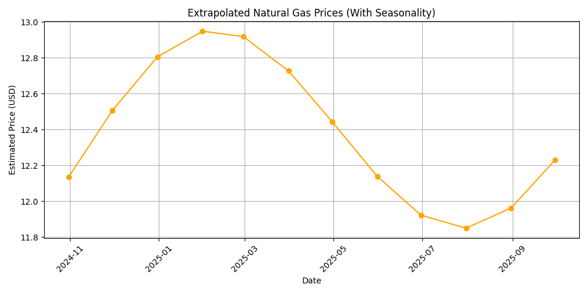

# JPMorgan's Quantitative Research


This project replicates the core responsibilities of a Quantitative Research Analyst at JPM by combining predictive modeling, credit risk analytics, and structured financial simulations. Using real-world-style datasets, we forecast commodity prices, quantify risk exposure, and price derivative contracts — all via reproducible and interpretable code.

---

## 🧠 Project Overview

This simulation spans four interconnected research components:

- **📉 Natural Gas Price Forecasting**  
  Time series modeling with trend + seasonality to extrapolate monthly natural gas prices for trading and contract valuation purposes.

- **📦 Storage Contract Valuation**  
  A structured pricing model for gas injection/withdrawal contracts, incorporating forecasted prices, volume rates, storage constraints, and operating costs.

- **🏦 Credit Rating Mapping**  
  FICO scores are discretized into 5-tier credit buckets using percentile segmentation — a common internal practice for risk-weighted asset modeling.

- **📊 Loan Default & Expected Loss Modeling**  
  Trains a machine learning model to estimate borrower default probabilities (PD) and computes expected losses on outstanding loans, accounting for recovery rates.

---

## 📈 Forecast Visualization — Gas Price Outlook



> Prices exhibit clear cyclical behavior, peaking in winter and bottoming out in summer — consistent with heating demand patterns.  
> This model captures the seasonal amplitude and trend drift, which are critical in valuing forward contracts.

---

## 🔍 Representative Results

| Module                      | Output Example                                               |
|-----------------------------|--------------------------------------------------------------|
| Storage Contract Valuation | **$2,537,500** net value (1MMBtu stored from Jun–Jan)         |
| Credit Rating              | FICO 722 → **Rating 1 (Best)**, FICO 572 → **Rating 5 (High Risk)** |
| Default Probability (PD)   | Borrower PD = **0.6524** based on financial profile           |
| Expected Credit Loss       | **$4,694.27** on $8,000 loan at 10% recovery rate             |
| Forecasted Gas Price       | **$12.6651** on **2025-04-15**, based on regression output    |

---

## ⚙️ Execution

To replicate the results:

1. Ensure the following input files are in your working directory:
   - `Nat_Gas.csv` — Monthly natural gas prices
   - `Task 3 and 4_Loan_Data.csv` — Loan-level mortgage data

2. Install dependencies:
   ```bash
   pip install pandas numpy matplotlib scikit-learn
   ```
3. Run each Python file independently:
   - `gas_analysis.py`: Forecast gas prices + generate plot
   - `contract_value.py`: Simulate and value storage trades
   - `fico_mortgage.py`: Map FICO → rating buckets
   - `loan_loss.py`: Estimate PD and expected losses via Random Forest
  
4. Note:  
   After running `fico_mortgage.py`, the enhanced dataset `Mortgage_Loan_Rating_Mapped.csv` will be generated, containing all borrower data plus a new `rating` column.

